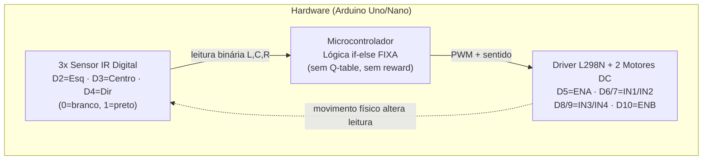
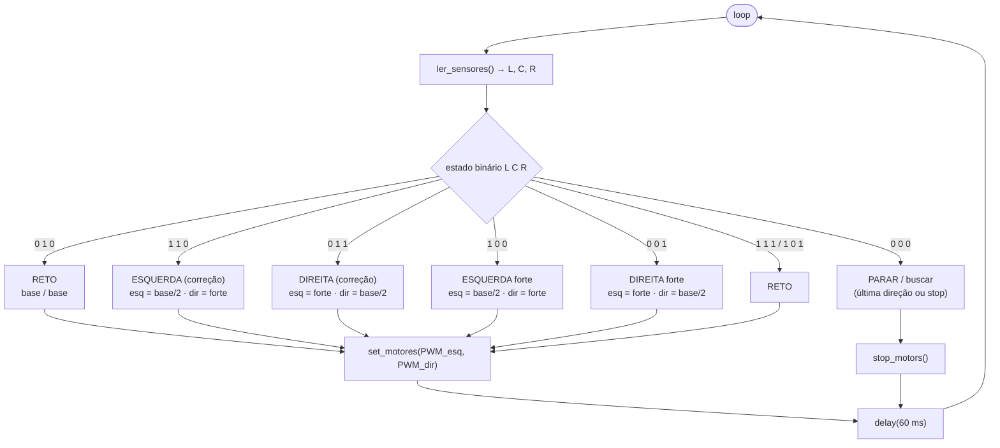
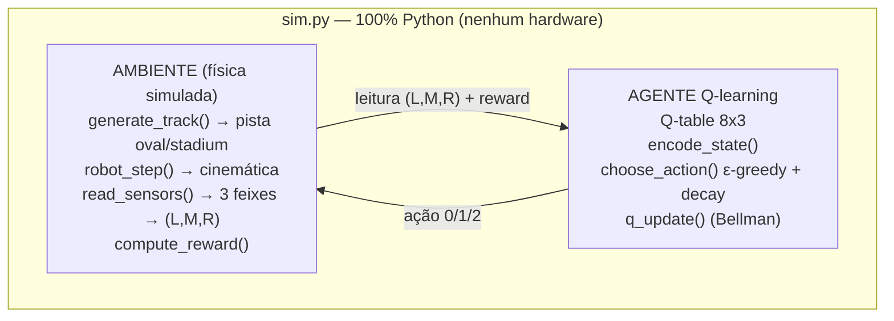
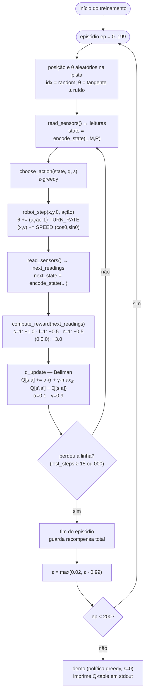
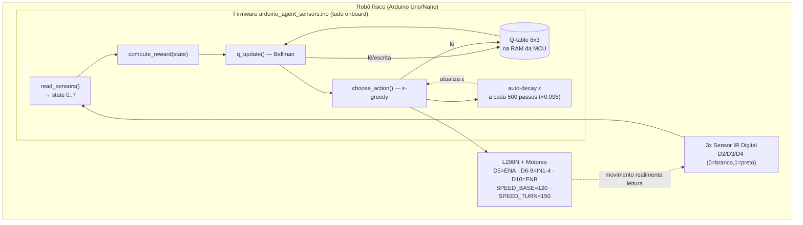

# Diagramas do TCC — Robô Seguidor de Linha com Q-learning

Apresenta o funcionamento da programação das **4 arquiteturas** do projeto. Cada seção traz um **diagrama de blocos** (arquitetura / onde roda cada parte) e um **fluxograma do ciclo de um passo** (loop principal), com o detalhamento completo do Q-learning (função de recompensa, Q-update de Bellman, política epsilon-greedy com decay e Q-table 8x3).

Convenção comum a todos os modos com sensores IR digitais:
- `0` = branco (sensor fora da linha) · `1` = preto (sensor sobre a linha)
- Estado `s = (L << 2) | (M << 1) | R` → 8 estados (0..7)
- Ações `0` = virar esquerda · `1` = reto · `2` = virar direita
- Hardware: 3 IR em D2/D3/D4, ponte H L298N em D5..D10

---

## Modo 1 — Seguidor Padrão (baseline, lógica if-else)

Robô físico real com controle **discreto fixo** (sem aprendizado). Serve de linha de base para comparar com o Q-learning. O Arduino apenas aplica regras determinísticas `if/else` sobre a leitura binária dos 3 sensores.

### 1.1 Diagrama de blocos



### 1.2 Fluxograma do loop principal



### 1.3 Tabela de regras fixas (baseline)

| L C R | Estado | Ação | Comportamento |
|:---:|:---:|:---:|---|
| 0 1 0 | centrado | reto | segue em frente |
| 1 1 0 | desvio p/ esquerda | virar esquerda | corrige à esquerda |
| 0 1 1 | desvio p/ direita | virar direita | corrige à direita |
| 1 0 0 | só esq na linha | virar esquerda forte | curva acentuada à esquerda |
| 0 0 1 | só dir na linha | virar direita forte | curva acentuada à direita |
| 1 1 1 | cruzamento / linha grossa | reto | segue em frente |
| 1 0 1 | cruzamento (gap central) | reto | segue em frente |
| 0 0 0 | perdeu a linha | parar / buscar | mantém última direção ou para |

> Sem `alpha`, `gamma`, `epsilon` ou Q-table: o comportamento é sempre o mesmo, não aprende com a experiência.

---

## Modo 2 — Simulador Python (`sim.py`)

Tudo roda **dentro do Python** (nenhum Arduino). Ambiente físico simulado e agente Q-learning coexistem no mesmo processo, em um único arquivo da stdlib.

### 2.1 Diagrama de blocos



### 2.2 Fluxograma do treinamento (episódios + passo)



### 2.3 Detalhe do algoritmo Q-learning

- **Política:** epsilon-greedy
  - com probabilidade `ε`: ação aleatória; senão `argmax_a Q[state, a]`
  - `ε` parte de `1.0` e decai multiplicativamente (`× 0.99`) até o mínimo `0.02`

- **Recompensa** (`compute_reward`):

  | leitura | reward |
  |---|---|
  | centro `m=1` | `+1.0` |
  | esquerda `l=1` | `−0.5` |
  | direita `r=1` | `−0.5` |
  | `(0,0,0)` (perdeu) | `−3.0` |

- **Atualização (Bellman):**
  `Q[s,a] ← Q[s,a] + α·( r + γ·max_a' Q[s',a'] − Q[s,a] )`

- **Q-table:** 8 (estados) × 3 (ações), iniciada em zero.

---

## Modo 3 — Seguidor Autônomo com Q-learning (`arduino_agent_sensors.ino`)

Robô físico real que aprende **onboard**, sem PC e sem serial. Liga, lê os IR, aciona os motores e atualiza a Q-table sozinho; o `epsilon` decai automaticamente a cada 500 passos.

### 3.1 Diagrama de blocos (firmware embarcado)



### 3.2 Fluxograma do loop de um passo

```mermaid
flowchart TD
  A([loop()]) --> L["state = read_sensors()<br/>(L<<2)|(C<<1)|R"]
  L --> R["reward = compute_reward(state)"]
  R --> Q{"prev_state ≥ 0?<br/>(há passo anterior)"}
  Q -->|sim| UP["q_update(prev_state, prev_action, reward, state)<br/>Q[s,a] += α·(r + γ·max Q[s',·] − Q[s,a])<br/>α=0.1 · γ=0.9"]
  Q -->|não| AC
  UP --> AC["action = choose_action(state)<br/>se random() < ε → aleatório<br/>senão argmax Q[state]"]
  AC --> MX["set_motors(action)<br/>0: esq/2, dir forte · 1: base/base<br/>2: esq forte, dir/2"]
  MX --> DL["delay(60 ms)"]
  DL --> SV["prev_state = state<br/>prev_action = action"]
  SV --> DK["step_count++<br/>se step_count % 500 == 0:<br/>ε = max(0.02, ε · 0.995)"]
  DK --> A
```

### 3.3 Detalhe do algoritmo (igual ao Modo 2, mas embarcado)

- **Recompensa** (idêntica ao `sim.py`): `c=1: +1.0`, `l=1: −0.5`, `r=1: −0.5`, `000: −3.0`
- **Q-update:** `Q[s,a] += α·(r + γ·max_a' Q[s',a'] − Q[s,a])`, com `α=0.1`, `γ=0.9`
- **Epsilon-greedy** com decaimento automático a cada `DECAY_STEPS = 500`: `ε ← max(0.02, ε · 0.995)`
- **Q-table 8x3** em RAM; **sem serial**, **sem PC**, **sem ambiente simulado**.

---

## Modo 4 — Arduino + Simulação (validação da Q-table via serial)

Ambiente simulado no PC (`train_serial.py`), “cérebro” Q-learning no Arduino/ESP32 (`arduino_agent.ino` / `esp32_agent.ino`). A Q-table vive na MCU; o PC só envia leituras e recompensa e recebe a ação de volta. Útil para **validar a Q-table em hardware real** antes de ir para o robô autônomo.

### 4.1 Diagrama de blocos (divisão de responsabilidades)

```mermaid
flowchart LR
  subgraph PY["PC — train_serial.py (APENAS AMBIENTE)"]
    TR["AMBIENTE simulado<br/>generate_track() · robot_step()<br/>read_sensors() · compute_reward()"]
    PROT["Camada serial<br/>envia 'L,M,R,reward'<br/>recebe 'action'"]
  end
  SER[("Serial USB<br/>115200 baud")]
  subgraph ARD["Arduino/ESP32 — *_agent.ino (APENAS AGENTE Q-learning)"]
    PARS["parse 'L,M,R,reward' → state"]
    QUP["Q-update — Bellman"]
    QSEL["ε-greedy → action"]
    QTBL[("Q-table 8x3<br/>na MCU")]
  end

  TR --> PROT
  PROT -->|bytes| SER
  SER -->|bytes| PARS
  PARS --> QUP
  QUP -->|lê/escreve| QTBL
  QTBL --> QSEL
  QSEL -->|action| SER
  SER -->|action| PROT
  PROT -->|usa action em robot_step()| TR
```

> Também há `FakeESP32` (modo `--fake`) que imita o protocolo em Python puro — útil para testar o ambiente sem hardware.

### 4.2 Diagrama de sequência do protocolo serial

```mermaid
sequenceDiagram
  participant Py as train_serial.py (PC)
  participant Ser as Serial USB @115200
  participant Ar as Arduino/ESP32 (agente)

  Py->>Ser: abre porta; espera "READY"
  Ar-->>Ser: "READY" (boot)
  Note over Ar: Q-table 8x3 zerada; ε=1.0

  loop cada episódio (200)
    Py->>Ser: "R\n" (reset + decay ε)
    Note over Ar: ε ← max(0.02, ε·0.99); zera prev_state
    loop cada passo (até MAX_STEPS=1000)
      Py->>Ser: "L,M,R,reward\n"
      Ar->>Ar: state = (L<<2)|(M<<1)|R
      Ar->>Ar: Q-update de (prev_state, prev_action) c/ reward
      Ar->>Ar: ε-greedy → action (0/1/2)
      Ar-->>Ser: "action\n"
      Ser-->>Py: action
      Py->>Py: robot_step(action); read_sensors; compute_reward
    end
  end

  Py->>Ser: "Q\n" (solicita Q-table)
  Ar-->>Ser: 8 linhas "s,Q0,Q1,Q2" + "END"
  Py->>Ser: "E0\n" (modo greedy p/ demo)
```

### 4.3 Protocolo serial (resumo)

| Sentido | Mensagem | Significado |
|---|---|---|
| Python → Arduino | `L,M,R,reward\n` | passo: leituras + recompensa |
| Arduino → Python | `action\n` (0/1/2) | ação escolhida pelo agente |
| Python → Arduino | `R\n` | reseta episódio e aplica decay de ε |
| Python → Arduino | `Q\n` | pede dump da Q-table |
| Arduino → Python | `s,Q0,Q1,Q2` ×8 + `END` | conteúdo da Q-table 8x3 |
| Python → Arduino | `E<valor>\n` | fixa ε (`E0` = greedy) |
| Arduino → Python | `READY` | boot concluído |

### 4.4 Q-learning no Arduino (idêntico ao Modo 3)

- Estado `s = (L<<2)|(M<<1)|R`, ações `0/1/2`, Q-table **8x3 zerada** na MCU.
- Q-update de Bellman: `Q[prev_state][prev_action] += α·(reward + γ·max Q[state][·] − Q[prev_state][prev_action])`, `α=0.1`, `γ=0.9`.
- ε-greedy: com prob. `ε` ação aleatória; senão `argmax_a Q[state][a]`.
- Decay de ε aplicado no comando `R` (a cada episódio): `ε ← max(0.02, ε·0.99)`.

---

## Comparativo rápido

| Modo | Ambiente | Agente Q-learning | Aprende? | Hardware | Serial |
|---|---|---|---|---|---|
| 1 — Padrão (if-else) | físico (robô real) | **nenhum** | não | sim | não |
| 2 — Simulador `sim.py` | simulado (Python) | em Python | sim | não | não |
| 3 — Autônomo Q-learning | físico (robô real) | embarcado no Arduino | sim | sim | não |
| 4 — Arduino + simulação | simulado (Python) | no Arduino/ESP32 | sim | MCU + PC | sim (USB) |

> O fluxo de uso no TCC costuma ser: treinar e validar a Q-table rapidamente no **Modo 2** (sim.py) ou **Modo 4** (validação em hardware via serial), e então carregar/executar a política no **Modo 3** (robô autônomo real), tendo o **Modo 1** como referência de desempenho.